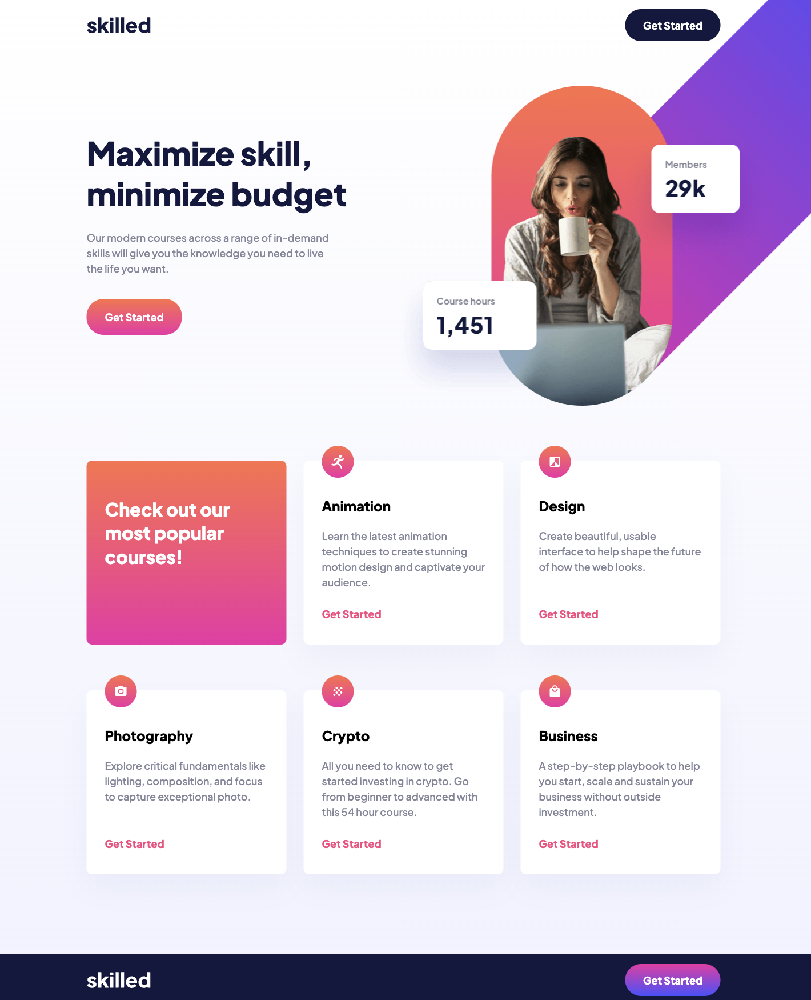

  <svg width="84" height="84" viewBox="0 0 20 20" fill="none" xmlns="http://www.w3.org/2000/svg">
    <path d="M7 12C7.26522 12 7.51957 11.8946 7.70711 11.7071C7.89464 11.5196 8 11.2652 8 11C8 10.7348 7.89464 10.4804 7.70711 10.2929C7.51957 10.1054 7.26522 10 7 10C6.73478 10 6.48043 10.1054 6.29289 10.2929C6.10536 10.4804 6 10.7348 6 11C6 11.2652 6.10536 11.5196 6.29289 11.7071C6.48043 11.8946 6.73478 12 7 12ZM11 11C11 11.2652 10.8946 11.5196 10.7071 11.7071C10.5196 11.8946 10.2652 12 10 12C9.73478 12 9.48043 11.8946 9.29289 11.7071C9.10536 11.5196 9 11.2652 9 11C9 10.7348 9.10536 10.4804 9.29289 10.2929C9.48043 10.1054 9.73478 10 10 10C10.2652 10 10.5196 10.1054 10.7071 10.2929C10.8946 10.4804 11 10.7348 11 11ZM13 12C13.2652 12 13.5196 11.8946 13.7071 11.7071C13.8946 11.5196 14 11.2652 14 11C14 10.7348 13.8946 10.4804 13.7071 10.2929C13.5196 10.1054 13.2652 10 13 10C12.7348 10 12.4804 10.1054 12.2929 10.2929C12.1054 10.4804 12 10.7348 12 11C12 11.2652 12.1054 11.5196 12.2929 11.7071C12.4804 11.8946 12.7348 12 13 12ZM3 5.5C3 4.83696 3.26339 4.20107 3.73223 3.73223C4.20107 3.26339 4.83696 3 5.5 3H14.5C15.163 3 15.7989 3.26339 16.2678 3.73223C16.7366 4.20107 17 4.83696 17 5.5V14.5C17 15.163 16.7366 15.7989 16.2678 16.2678C15.7989 16.7366 15.163 17 14.5 17H5.5C4.83696 17 4.20107 16.7366 3.73223 16.2678C3.26339 15.7989 3 15.163 3 14.5V5.5ZM5.5 4C5.10218 4 4.72064 4.15804 4.43934 4.43934C4.15804 4.72064 4 5.10218 4 5.5V14.5C4 14.8978 4.15804 15.2794 4.43934 15.5607C4.72064 15.842 5.10218 16 5.5 16H14.5C14.8978 16 15.2794 15.842 15.5607 15.5607C15.842 15.2794 16 14.8978 16 14.5V7H9.5C9.10218 7 8.72064 6.84196 8.43934 6.56066C8.15804 6.27936 8 5.89782 8 5.5V4H5.5ZM16 5.5C16 5.10218 15.842 4.72064 15.5607 4.43934C15.2794 4.15804 14.8978 4 14.5 4H9V5.5C9 5.63261 9.05268 5.75979 9.14645 5.85355C9.24021 5.94732 9.36739 6 9.5 6H16V5.5Z" fill="#9747FF"/>
  </svg>
  <h1>Landing Page Basic</h1>
  
<em>This project is strongly inspired by Frontentmemtor's challeges</em>

 

## About the Project 
 

 
 
This project was done to help me get started with my basic knowledge and implement it to develop a basic landing page to reinforce the knowledge developed in my short life as a student of various basic technologies in the web developer Frontend. 
 
 

## Built 👷🏼‍♂️

The technologies and tools used to develop this website are: 
 

* Tools:
    * VScode
    * Chrome
    * Git

 

* Languages:
    * HTML
    * CSS
    * SCSS

## Inspiration 🔗

As I said this page is inspired by the Frontentmentor challenge where I have practiced with several challenges that I detail below: with their respective links.

 

### This Challenge:
* 🔗 Link: https://achipre.github.io/landing-page-basic
* 📦 Repository: https://github.com/achipre/landing-page-basic
* 💎 FrontendMentor: https://www.frontendmentor.io/challenges/skilled-elearning-landing-page-S1ObDrZ8q

### Other Frontentmemtor's challeges:

#### 1) Product Card

* 🔗 Link: https://achipre.github.io/product-preview-basic
* 📦 Repository: https://github.com/achipre/product-preview-basic
* 💎 FrontendMentor: https://www.frontendmentor.io/challenges/product-preview-card-component-GO7UmttRfa
